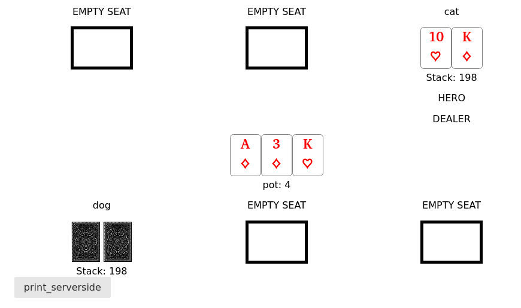
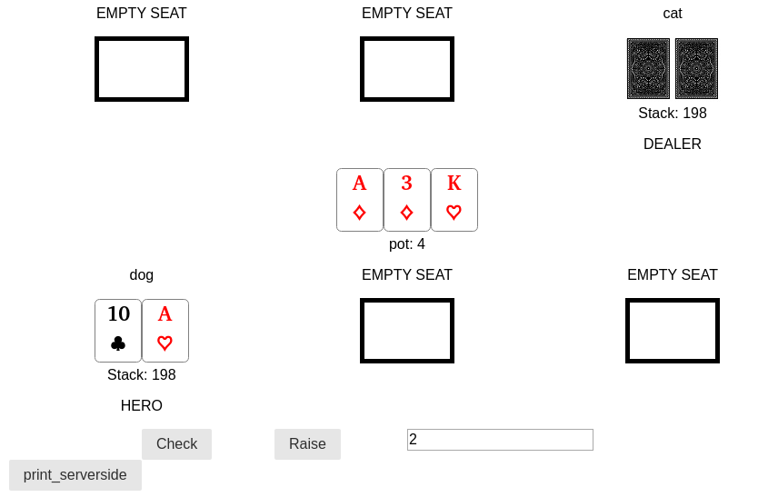

# holdem

## Demo
### Screenshots
### Player 1 screen

### Player 2 screen


## How to run locally
### Install
In the root folder, as well as the client folder, run the command:
```
npm install
```

### Running the Server
In the server folder, run:
```
node index
```

### Running the React App
In the client folder, run:
```
npm start
```

### Accessing the application
Open up a web browser and go to localhost:3000 to access the app. Use multiple tabs/ windows in order to create multiple connections and play the game.
